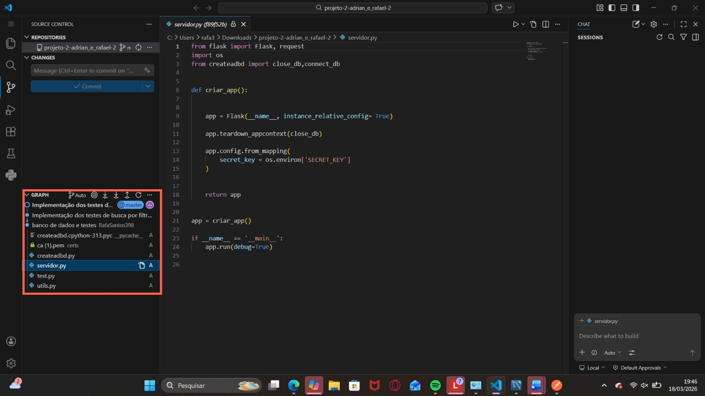
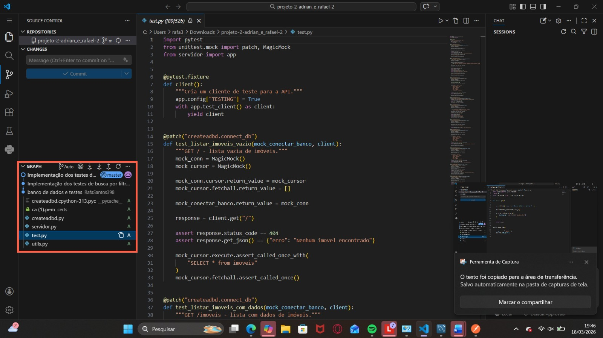

# Projeto 2 - Programação Eficaz
Feito por: Adrian Camargo e Rafael Santos

# Deploy
http://44.200.112.255/imoveis

# Nossa Jornada
Durante nossa jornada nesse incrivel trabalho cheio de aventuras e experiências houve batalhas e entraves, uma delas, a mais marcante foi no ínicio, em que nossos githubs estavam dessincronizados, então tivemos que batalhar bravamente para descobrir um solução, devido a isso, nosso commit inicial já possuia uma boa parte já construida. Sendo possível ver a ordem dos commits anteriores a partir das imagens:

## Imagens

### Servidor

Progresso anterior do Servidor, com a base pronta mas sem nenhuma rota.

### Testes

Progresso anterior dos testes, sendo feito antes das rotas conforme o TDD.